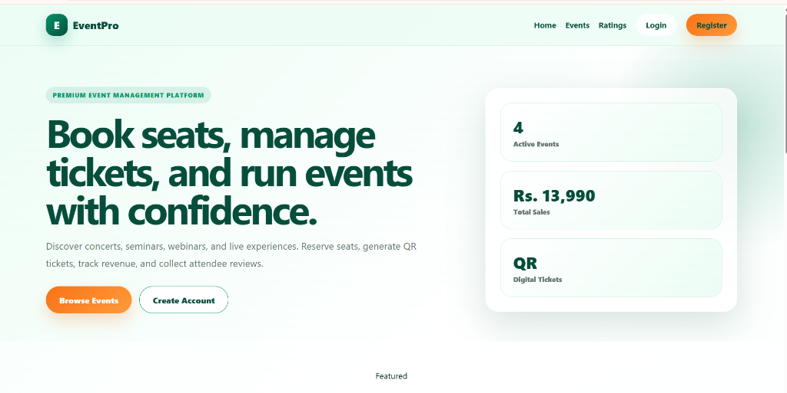
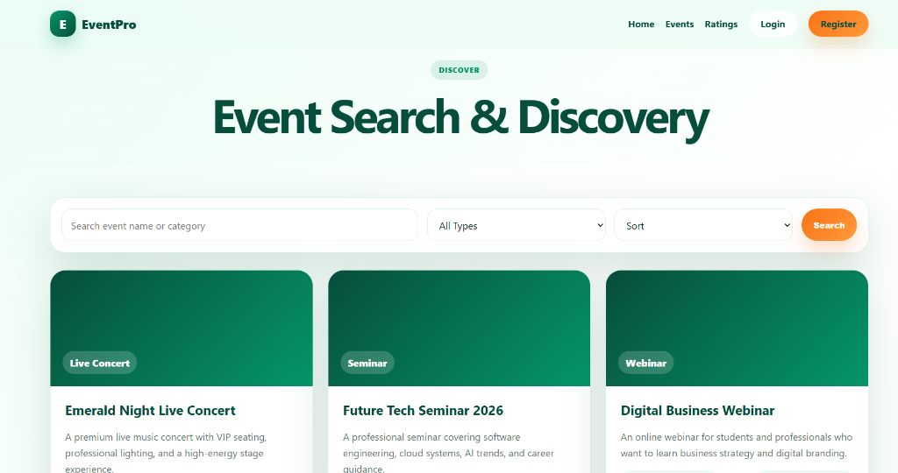
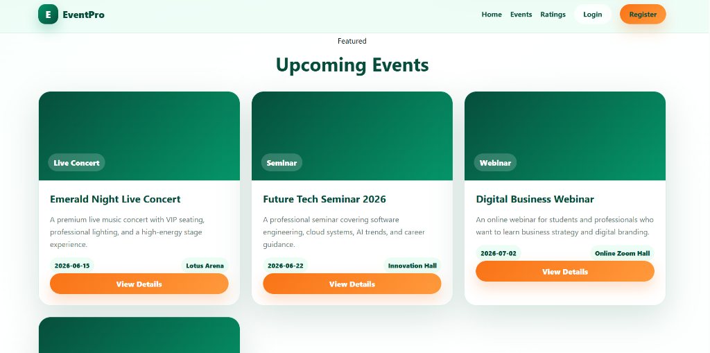

<div align="center">
  
  
  <h1>🎉 EventPro - Event Booking Management System</h1>
  <p>A comprehensive, dynamic, and user-friendly platform for managing and booking events.</p>

  [](#)
  [](#)
  [](#)
  [](#)
  [](#)
</div>

<br>

## 📖 About The Project

**EventPro** is a fully functional Event Booking and Management System built with **Java Servlets, JSP, and Maven**. It provides a seamless experience for both attendees looking to book events and administrators managing them. 

The system supports various event types (Concerts, Seminars, Webinars) and different seating arrangements (Standard, VIP).

---

## ✨ Key Features

### For Users (Attendees):
* **User Authentication:** Secure Login and Registration.
* **Event Discovery:** Browse and search for upcoming events.
* **Ticket Booking:** Reserve seats for live events and generate digital tickets.
* **My Tickets:** View booking history and managed purchased tickets.
* **Ratings & Reviews:** Submit feedback and rate attended events.

### For Administrators:
* **Admin Dashboard:** Overview of total sales, active events, and recent bookings.
* **Event Management:** Create, update, and delete events.
* **Financial Summary:** Track revenue and ticket sales.
* **User Management:** Monitor and manage registered users.

---

## 📸 Screenshots

### Event Search & Discovery


### Featured Upcoming Events


---

## 🚀 Tech Stack

* **Backend:** Java 17, Jakarta Servlets 6.0
* **Frontend:** HTML5, CSS3, JavaScript, JSP
* **Build Tool:** Maven
* **Server:** Apache Tomcat 10+
* **Data Storage:** File-based data persistence

---

## 💻 How to Run Locally

1. **Clone the repository:**
   ```bash
   git clone https://github.com/Nayana-Madhuranjana/Event-Booking-System.git
   ```
2. **Open in IntelliJ IDEA:**
   Open the inner `EventBookingSystem_Website` directory.
3. **Load Maven Project:**
   Click on the Maven popup to import dependencies.
4. **Configure Smart Tomcat:**
   * Context Path: `/`
   * Deployment Directory: `src/main/webapp`
5. **Run** the server and navigate to `http://localhost:8080/`.

---
<div align="center">
  <i>Developed by Nayana Madhuranjana</i>
</div>
